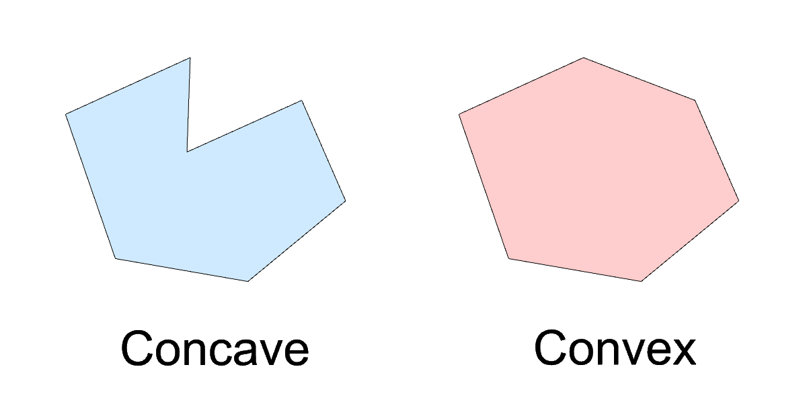

# Construct_Mesh_from_CLosed_Curve  

閉じたポリラインのメッシュ埋めアルゴリズム  

---  

### Type  

Concave or Convex  

  

---  

### Concave  

// 凹型  

---  

### Convex

// 凸型  

---

### ref.  

- What is the difference between Concave and Convex?  
  - Torque というゲームエンジン？の衝突判定か何かの凹型、凸型の説明  
  - [http://www.rustycode.com/projects/Docs/What%20is%20the%20difference%20between%20Concave%20and%20Convex.html](http://www.rustycode.com/projects/Docs/What%20is%20the%20difference%20between%20Concave%20and%20Convex.html)  

---  